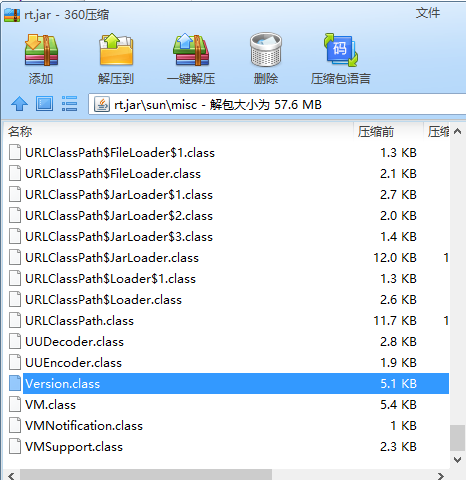

#### 面试题：

```java
String str1 = new StringBuilder("58").append("tongcheng").toString();
System.out.println(str1);
System.out.println(str1.intern());
// 结果为true
System.out.println(str1.intern() == str1);

System.out.println();

String str2 = new StringBuilder("ja").append("va").toString();
System.out.println(str2);
System.out.println(str2.intern());
// 结果为false
System.out.println(str2.intern() == str2);
```

#### String:intern()

```java
/**
 * Returns a canonical representation for the string object.
 * <p>
 * A pool of strings, initially empty, is maintained privately by the
 * class {@code String}.
 * <p>
 * When the intern method is invoked, if the pool already contains a
 * string equal to this {@code String} object as determined by
 * the {@link #equals(Object)} method, then the string from the pool is
 * returned. Otherwise, this {@code String} object is added to the
 * pool and a reference to this {@code String} object is returned.
 * <p>
 * It follows that for any two strings {@code s} and {@code t},
 * {@code s.intern() == t.intern()} is {@code true}
 * if and only if {@code s.equals(t)} is {@code true}.
 * <p>
 * All literal strings and string-valued constant expressions are
 * interned. String literals are defined in section 3.10.5 of the
 * <cite>The Java&trade; Language Specification</cite>.
 *
 * @return  a string that has the same contents as this string, but is
 *          guaranteed to be from a pool of unique strings.
 * @jls 3.10.5 String Literals
 */
public native String intern();
```

​		String:intern()是一个本地方法，它的作用是如果字符串常量池中已经包含一个等于此String对象的字符串，则返回代表池中这个字符串的String对象的引用；否则，会将此String对象包含的字符串添加到常量池中，并且返回此String对象的引用。

#### 方法区和运行时常量溢出

​		由于运行时常量池是方法区的一部分，所以这两个区域的溢出测试可以放到一起进行。HotSpot从JDK7开始逐步“去永久代”的计划，并在JDK8中完全使用元空间来代替永久代。

​		在JDK6或更早之前的HotSpot虚拟机中，常量池都是分配在永久代中，可以通过-XX:PermSize和-XX:MaxPermSize限制永久代的大小，即可间接限制其中常量池的常量。

#### 为什么两个结果不一样？

​		在字符串常量池中已有一个java的字符串（JDK自带的），在sun.misc.Version类中定义，加载这个类时“java"字符串加入常量池。

#### 过程

```java
public final class System {
    /* Register the natives via the static initializer.
     *
     * VM will invoke the initializeSystemClass method to complete
     * the initialization for this class separated from clinit.
     * Note that to use properties set by the VM, see the constraints
     * described in the initializeSystemClass method.
     */
    private static native void registerNatives();
    
    ...
        
    /**
     * Initialize the system class.  Called after thread initialization.
     */
    private static void initializeSystemClass() {

        // VM might invoke JNU_NewStringPlatform() to set those encoding
        // sensitive properties (user.home, user.name, boot.class.path, etc.)
        // during "props" initialization, in which it may need access, via
        // System.getProperty(), to the related system encoding property that
        // have been initialized (put into "props") at early stage of the
        // initialization. So make sure the "props" is available at the
        // very beginning of the initialization and all system properties to
        // be put into it directly.
        props = new Properties();
        initProperties(props);  // initialized by the VM

        // There are certain system configurations that may be controlled by
        // VM options such as the maximum amount of direct memory and
        // Integer cache size used to support the object identity semantics
        // of autoboxing.  Typically, the library will obtain these values
        // from the properties set by the VM.  If the properties are for
        // internal implementation use only, these properties should be
        // removed from the system properties.
        //
        // See java.lang.Integer.IntegerCache and the
        // sun.misc.VM.saveAndRemoveProperties method for example.
        //
        // Save a private copy of the system properties object that
        // can only be accessed by the internal implementation.  Remove
        // certain system properties that are not intended for public access.
        sun.misc.VM.saveAndRemoveProperties(props);


        lineSeparator = props.getProperty("line.separator");
        sun.misc.Version.init();

        FileInputStream fdIn = new FileInputStream(FileDescriptor.in);
        FileOutputStream fdOut = new FileOutputStream(FileDescriptor.out);
        FileOutputStream fdErr = new FileOutputStream(FileDescriptor.err);
        setIn0(new BufferedInputStream(fdIn));
        setOut0(newPrintStream(fdOut, props.getProperty("sun.stdout.encoding")));
        setErr0(newPrintStream(fdErr, props.getProperty("sun.stderr.encoding")));

        // Load the zip library now in order to keep java.util.zip.ZipFile
        // from trying to use itself to load this library later.
        loadLibrary("zip");

        // Setup Java signal handlers for HUP, TERM, and INT (where available).
        Terminator.setup();

        // Initialize any miscellenous operating system settings that need to be
        // set for the class libraries. Currently this is no-op everywhere except
        // for Windows where the process-wide error mode is set before the java.io
        // classes are used.
        sun.misc.VM.initializeOSEnvironment();

        // The main thread is not added to its thread group in the same
        // way as other threads; we must do it ourselves here.
        Thread current = Thread.currentThread();
        current.getThreadGroup().add(current);

        // register shared secrets
        setJavaLangAccess();

        // Subsystems that are invoked during initialization can invoke
        // sun.misc.VM.isBooted() in order to avoid doing things that should
        // wait until the application class loader has been set up.
        // IMPORTANT: Ensure that this remains the last initialization action!
        sun.misc.VM.booted();
    }
}
```

​		注册本地方法是通过静态初始化加载。虚拟机将会调用initializeSystemClass方法去完成这个类的加载以便于区别客户端。注意如果要使用VM设置的参数，请看initializeSystemClass方法描述的约束条件。

​        initializeSystemClass将在线程初始化完成后被调用，可以看到initializeSystemClass方法中的一行sum.misc.Version.init();

​		再来看sum.misc.Version类结构

```java
public class Version {
    private static final String launcher_name = "java";
    private static final String java_version = "1.8.0_251";
    private static final String java_runtime_name = "Java(TM) SE Runtime Environment";
    private static final String java_profile_name = "";
    private static final String java_runtime_version = "1.8.0_251-b08";
    private static boolean versionsInitialized;
    private static int jvm_major_version;
    private static int jvm_minor_version;
    private static int jvm_micro_version;
    private static int jvm_update_version;
    private static int jvm_build_number;
    private static String jvm_special_version;
    private static int jdk_major_version;
    private static int jdk_minor_version;
    private static int jdk_micro_version;
    private static int jdk_update_version;
    private static int jdk_build_number;
    private static String jdk_special_version;
    private static boolean jvmVersionInfoAvailable;

    public Version() {
    }

    public static void init() {
        System.setProperty("java.version", "1.8.0_251");
        System.setProperty("java.runtime.version", "1.8.0_251-b08");
        System.setProperty("java.runtime.name", "Java(TM) SE Runtime Environment");
    }
}
```

​		可以看到Version中定义了final成员luancher_name="java"

#### sun.misc.Version来源

​		（这部分涉及类加载器和rt.jar的知识）

​		根加载器将会提前部署加载rt.jar（安装的jdk/jre/lib）



#### OpenJDK8源码

[OpenJDK (java.net)](https://openjdk.java.net/)

openjdk8/jdk/src/share/classes/sun/misc

#### 考察点

1、是否理解String:intern()方法

2、是否阅读过经典书籍

​      出处：《深入理解java虚拟机》——周志明

​      第2章2.4.3节

